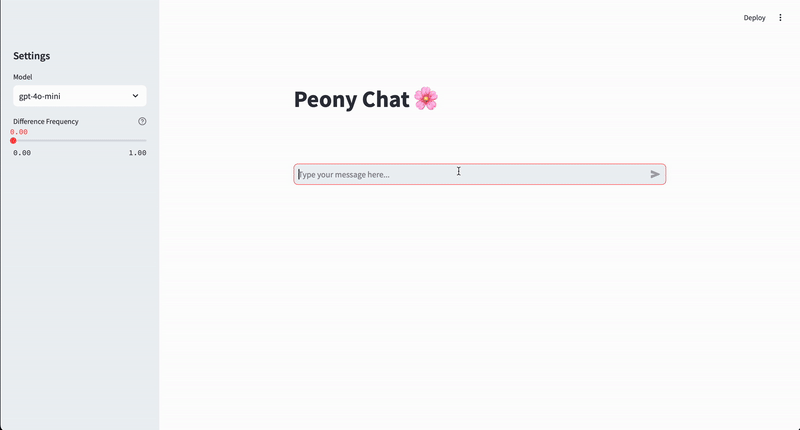

# Peony 🌸
Streamline LLM Preference Optimization through effortless user feedback collection

## What is Peony?
Peony is a lightweight Python package that simplifies the process of collecting, managing, and leveraging user preferences for LLM preference optimization. By automating the comparison of different LLM outputs and gathering user feedback, Peony helps developers build better, more fine-tuned language models with minimal effort.

## Key Features
- **Simple Integration**: Compatible with OpenAI and Anthropic API (more coming soon!)
- **Flexible Storage**: Extensible adapter for datastore of your choice
- **Finetuning Ready**: Structured data is ready for immediate use for finetuning

## Try Out
`docker compose up --build` to run simple demo of how it works in the UI.